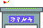
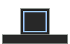

# BCGameJam2020
My groups submission for BC Game Jam 2020!

To see source code and contributions please visit this link: https://github.com/jayjayish/KillAllBoxes

Team Members:

Loved working with this team! Please go check out their profiles also!

Me: https://github.com/ConfirmedToBeACabbage

https://github.com/mslongo

https://github.com/cheeshee

https://github.com/jayjayish

https://github.com/brandonchan03

Sponsor Winner: Raccopack

Game Description: Packages need to be sent out of the factory in the timely fashion! Work against the clock to get as many
correct shipments out of the factory! What highscore can you reach? 

## Premise

You have 3 types of boxes you need to work with:

 Fragile Box | Chance Of Breaking | 

 Heavy Box | Slows Movement | 

 Box | Just A Box | 

These three boxes will have an effect on your player! 

You have to make sure that when the orders come in, you get the right stickers or bubble wrap on the box with these three stations: 

 Bubble Wrap | Apply Bubble Wrap | 

 Red Sticker | Apply Red Sticker | 

 White Sticker | Apply White Sticker | 

 Blue Sticker | Apply Blue Sticker | 

Make sure that your box is also safe! 

 X-Ray Station | Check If Box Is Safe |

 Incinerator | Destroy Box |

## Controls

You have to work together with your coop partner to get a high score! 

#### Player 1 Controls 

Movement | Up-Left-Right-Down Arrow_Keys

Pickup/Drop | Right Shift

#### Player 2 Controls

Movement |  WASD

Pickup/Drop | Left Shift

#### Player to Player Interaction

1) You cannot walk through each other
2) You can pass a box to each other by hitting shift

